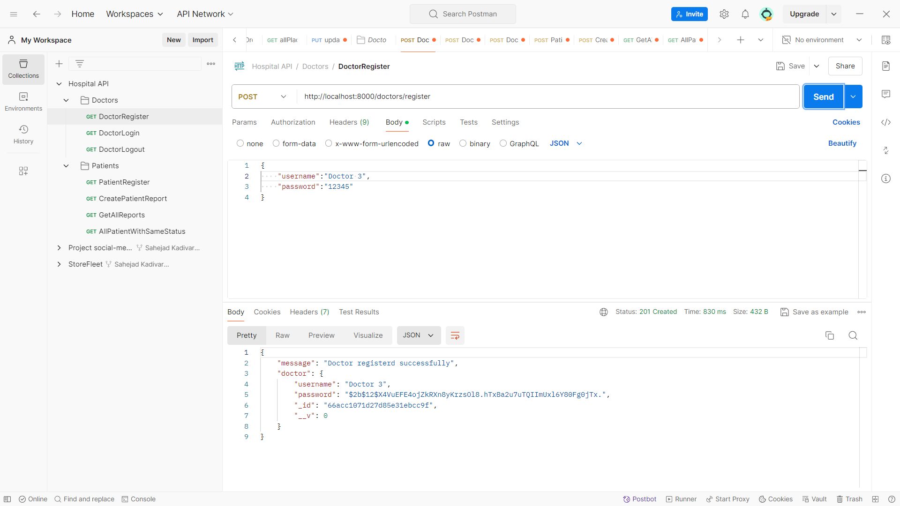
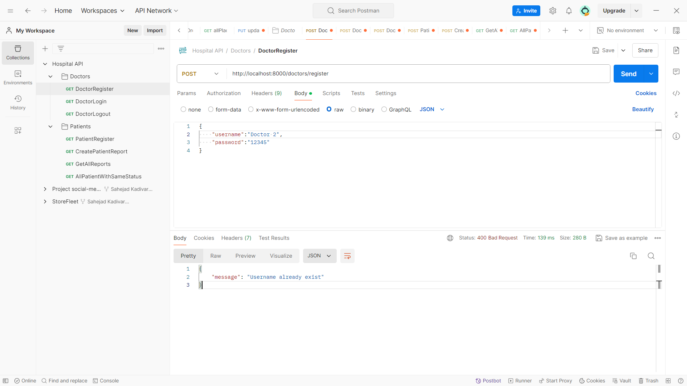
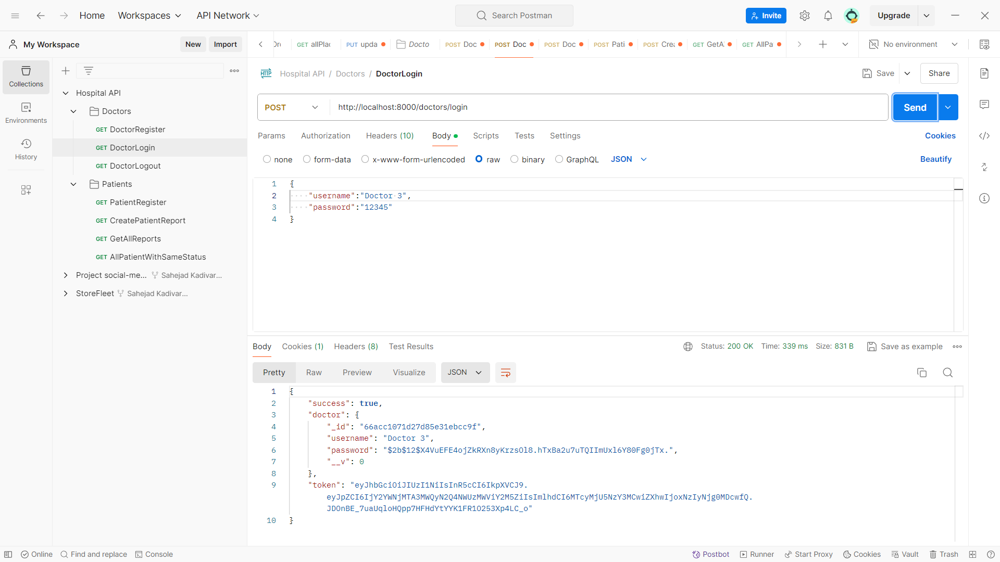

# Hospital API 🚀
Welcome to the Hospital API. This API is designed for doctors and patients to manage patient reports and track patient health, aiming to control the spread of COVID-19 effectively.

## ⭐ Introduction

The Hospital API is designed to facilitate doctors working in a hospital designated by the government for COVID-19 patient testing, quarantine, and well-being management. It provides essential functionalities to manage patient data, track test results, allocate quarantine facilities, and ensure the overall health and safety of COVID-19 patients.

It is created using the REST API pattern and built with MongoDB, ExpressJS, NodeJS, and Mongoose. Swagger is used to provide a testing UI.

## Features
- **Authentication**: Secure authentication system for doctors.
- **Authorization**: Role-based access control for managing resources.
- **Operations**: Create, read, and update doctors, and patients.
- **Relationships**: Establish relationships between hospitals, doctors, and patients.
- **Search**: Search functionality to find hospitals, doctors, and patients by various criteria.
- **Error Handling**: Proper error handling and response messages.

## Technologies Used
- **Node.js**: JavaScript runtime environment.
- **Express.js**: Web application framework for Node.js.
- **MongoDB**: NoSQL database for storing hospital, doctor, and patient data.
- **Mongoose**: MongoDB object modeling tool for Node.js.
- **JWT**: JSON Web Tokens for secure authentication.
- **Bcrypt**: Library for hashing passwords securely.
- **Swagger**: A tool for designing, building, and documenting RESTful APIs with an interactive user interface for testing.

## File Structure
```csharp
Hospital API/
├── config/                     # contains the configuration File For connecting with database.
├── middlewares/                # Contains authrentication middleware
├── src/                        # contains all the source files of REST API
|    └── doctors/               # Contains all the Required files of Doctor API
|    |     └── controllers/     # All business logic   
|    |     └── models/          # Schemas and repository
|    |     └── routes/          # Route definitions
|    └── patients/              # Contains all the Required files of patient API
|    |     └── controllers/     # All business logic
|    |     └── models/          # Schemas and repository
|    |     └── routes/          # Route definitions
|    └── utils/                 # For sending JWT token
├── index.js                    # Express application setup
├── package.json                # NPM package configuration
├── README.md                   # Project README File
├── .gitignore                  # Git ignore configuration
|── swagger.json                # Contain Swagger components For test API UI

```
## 🔥 Getting Started With The Project

1. Clone the repository:

    ```bash
    git clone https://github.com/sahejadkadivar/Hospital-API
    ```

2. Install dependencies:

    ```bash
    cd Hospital_API
    npm install
    ```

3. Set up environment variables:

    Create a `.env` file in the root directory and add the following variables:

    ```plaintext
    PORT=6000
    DB_URL=your_mongodb_uri
    JWT_Secret=your_jwt_secret
    JWT_Expire=specify days in which token expires

    ```

4. Start the server:

    ```bash
    npm start
    ```
## API Documentation


The API documentation is available using Swagger UI. After starting the server, navigate to `http://localhost:8000` there you can click on provided link or navigate to `http://localhost:8000/api-docs/`in your browser to view the API documentation and test the endpoints.

## Screenshots









## Contributing
Feel free to contribute to this project by creating issues or submitting pull requests. Your contributions are welcome!
## Hosted URL
The Hospital API is currently hosted on Render.

link for trial is:
[click here to experience it!](https://employee-review-system-nlcl.onrender.com)

## Authors

- [sahejadkadivar](https://github.com/sahejadkadivar)

## 🐦 Follow Me:

> [LinkedIn](https://www.linkedin.com/in/sahejad-kadivar-667bb9227/)


I hope you like the project. Thanks for reading :)


